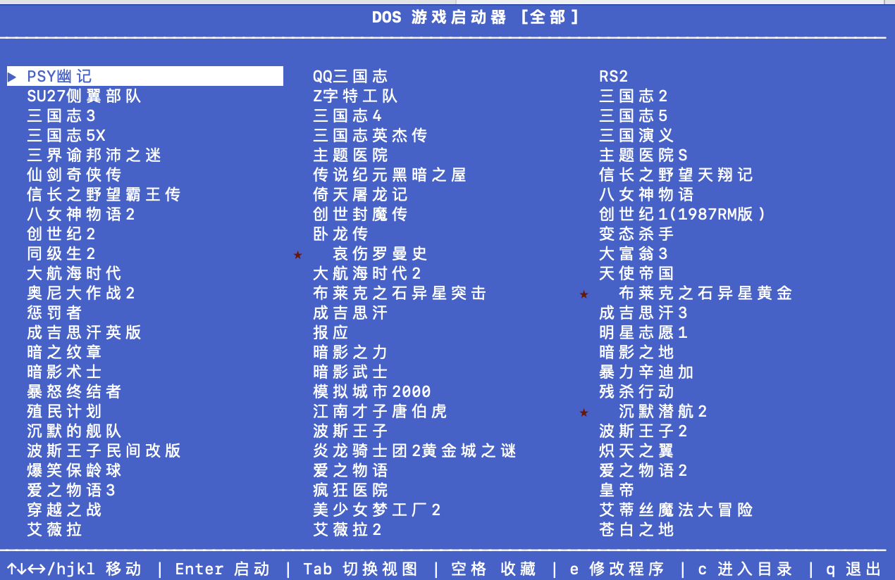

# DOS 游戏库启动器

一个基于终端的 DOS 游戏管理工具，支持批量解压、自动检测启动程序、图形化选择列表，以及 DOSBox-X 一键启动。

## 特性

- **批量解压**：自动将中文命名的 ZIP 游戏包解压为拼音/英文目录
- **自动检测启动程序**：智能识别 `PLAY.BAT`、主 `.EXE` 等启动文件
- **图形化启动器 (TUI)**：基于 `curses` 的中文游戏选择界面
- **多列自适应布局**：根据终端宽度自动显示 1~3 列
- **收藏系统**：按空格键收藏游戏，Tab 切换全部/收藏视图
- **快捷操作**：一键修改启动程序、一键进入 DOSBox-X 命令行调试
- **独立配置文件**：每个游戏拥有独立的 `dosbox-x.conf`

## 目录结构

```
/Users/elon/game/dos/
├── bin/                    # 原始 ZIP 游戏包（中文文件名）
├── games/                  # 解压后的游戏目录（英文/拼音名）
│   └── mapping.json        # 中文名 ↔ 英文目录 ↔ 启动文件 映射
├── conf/                   # 每个游戏的 dosbox-x 配置文件
├── dosbox-x.conf           # dosbox-x 配置模板
├── setup_games.py          # 解压 / 更新 / 配置生成脚本
├── launcher.py             # 图形化游戏启动器
└── README.md               # 本文件
```

## 快速开始

### 1. 环境要求

- Python 3.9+
- [dosbox-x](https://dosbox-x.com/)（已安装并可用）
- 在windows下需要额外安装 python -m pip install windows-curses
### 2. 初始化游戏库

```bash
cd /Users/elon/game/dos
python3 setup_games.py
```

`setup_games.py` 会完成以下操作：

1. 扫描 `bin/` 下所有 `.zip` 文件
2. 将中文文件名转为拼音，解压到 `games/` 下的英文目录
3. 自动检测每个游戏的主启动程序（`.EXE` / `.BAT`）
4. 基于 `dosbox-x.conf` 模板，为每个游戏生成独立配置文件到 `conf/`
5. 写入 `games/mapping.json` 保存映射关系

### 3. 启动游戏

```bash
python3 launcher.py
```

## 界面预览



## 按键说明

| 按键 | 功能 |
|------|------|
| `↑↓←→` / `hjkl` | 移动选择 |
| `Enter` | 启动选中的游戏 |
| `Space` | 收藏 / 取消收藏 |
| `Tab` | 切换视图（全部 / 收藏） |
| `e` | 修改当前游戏的启动程序名 |
| `c` | 进入 DOSBox-X 命令行（只挂载目录，不运行程序） |
| `PgUp` / `PgDn` | 翻页 |
| `q` / `Esc` | 退出 |

## 添加新游戏

1. 将新的 ZIP 包放入 `bin/` 目录
2. 运行 `python3 setup_games.py`
3. 脚本会自动识别新包，解压并生成配置

> 已有游戏不会被重复解压，只会更新映射和配置文件。

## 修改游戏启动程序

### 方式一：在启动器中修改（推荐）

1. 运行 `python3 launcher.py`
2. 选中要修改的游戏
3. 按 `e`，底部会显示当前的启动程序名
4. 直接编辑后按 `Enter` 保存，或按 `Esc` 取消

### 方式二：手动修改配置文件

编辑 `conf/<游戏目录名>.conf` 中 `[autoexec]` 段的最后一行即可。

### 方式三：修改 mapping.json

编辑 `games/mapping.json` 中对应条目的 `exe` 字段，然后运行：

```bash
python3 setup_games.py
```

这会重新生成所有配置文件。

## 进入游戏目录进行调试

有些游戏首次运行需要先执行 `SETUP.EXE` 或 `INSTALL.EXE` 配置声卡/显卡：

1. 在启动器中选中该游戏
2. 按 `c` 键
3. DOSBox-X 会挂载该游戏目录并停留在命令行，你可以手动运行安装程序

## 常见问题

### ZIP 解压失败

部分老游戏 ZIP 文件可能损坏。运行 `setup_games.py` 时会在终端提示 `Bad ZIP file`，这些游戏需要手动修复或替换 ZIP 包。

### 启动程序识别错误

自动检测基于启发式规则（优先 `PLAY.BAT`，其次最大体积的 `.EXE`），偶尔可能会选中非主程序。遇到这种情况，在启动器中按 `e` 修改为正确的启动程序名即可。

### 磁盘镜像类游戏

极少数游戏（如 `哀伤罗曼史`）使用的是软盘/硬盘镜像格式（`.img`），没有标准 DOS 可执行文件。这类游戏需要手动配置 `imgmount`，无法通过本启动器直接启动。

## 技术栈

- Python 3.9+
- `curses`（终端 UI）
- `pypinyin`（中文转拼音）
- `dosbox-x`（DOS 模拟器）
